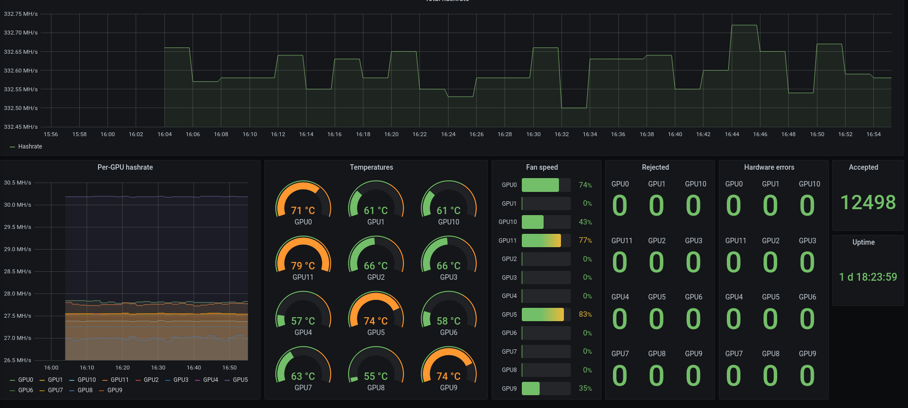

## TRM, Lolminer, T-Rex, miners with EthMan-compatible API (Phoenix miner, Nanominer, Claymore's, etc.) monitoring based on Prometheus and Grafana

### TL;DR
I can help with the setup inexpensively. Write me in Telegram: `@nouveau_nvc0`.
### Deploying
Run miners with following params:

- Teamredminer: `--api_listen=0.0.0.0:4028`
- Lolminer: `--apiport 4069`
- T-Rex: `--api-bind-http 0.0.0.0:4067`
- Claymore's ETH, Phoenix and Nanominer listen on `3333` port by default. For other miners EthMan-compatible API check the documentation
- NVMiner (https://github.com/mhssamadani/Autolykos2_NV_Miner) listens on port `36207` by default

#### Custom ports/Having issues with automated rig search
If you are using ports different than default ones or the script cannot find all your miners you should create `mining-exporter/config` file. It's example content:
```
rig1=( trm 192.168.1.123 40281 )
rig2=( t-rex 192.168.1.123 40671 )
rig3=( lolminer 192.168.1.123 40691 )
rig4=( ethman 192.168.1.123 33331 )
rig5=( nvminer 192.168.1.123 36207 )
```
And then (re)build `prometheus-mining_exporter` container image using `docker-compose`.

#### Warning
If your local subnet is other than 192.168.1.1/24 and you are using automated rigs search you must change it in the top of the `mining-exporter/server.sh` file.

#### Without Telegram alerts
```
docker-compose -f docker-compose.yml up --build
```

#### With Telegram alerts
Create Telegram bot (write `@botfather`) and get your user ID (write `@userinfobot`). For details: https://github.com/metalmatze/alertmanager-bot
```
cp alertmanager-bot.sh.example alertmanager-bot.sh
```
Then open `alertmanager-bot.sh` and configure it.
```
docker-compose -f docker-compose-alertmanager-bot.yml up --build
```

Finally open `http://<server address>:3000/` in your browser.
After login to Grafana you should import json dashboards from `dashboards` dir.

#### If you want to buy me a coffee
BTC: `bc1qtv30ctkad9h2gnupx9pa59cgvpatswx5z90phc`
